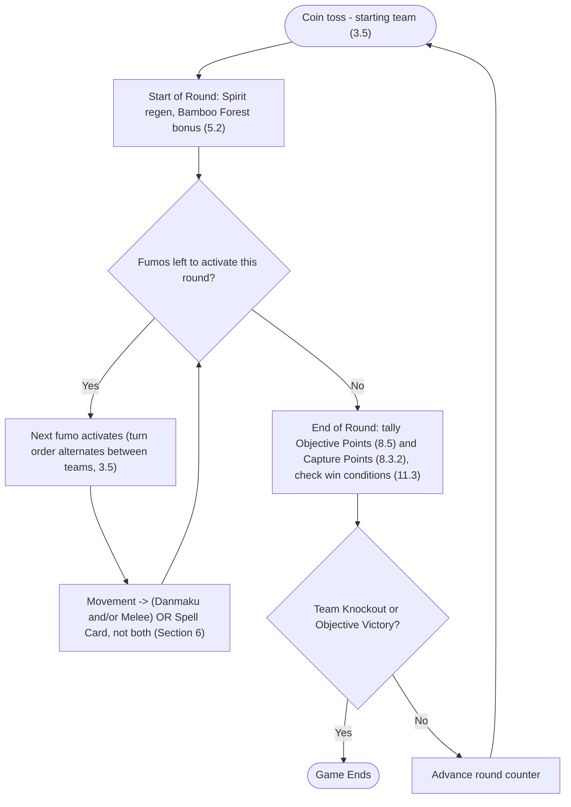
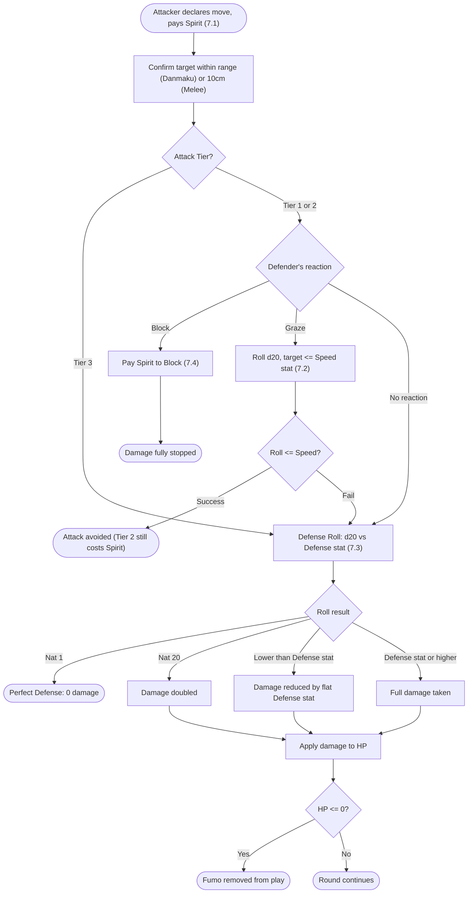

# FUMOHAMMER
### Core Rules — Draft v0.1

---

- [FUMOHAMMER](#fumohammer)
    - [Core Rules — Draft v0.1](#core-rules--draft-v01)
  - [1. Introduction \& Lore](#1-introduction--lore)
    - [1.1 Premise](#11-premise)
    - [1.2 Setting](#12-setting)
    - [1.3 The Two Sides](#13-the-two-sides)
      - [Side A — Gensokyolites](#side-a--gensokyolites)
      - [Side B — Lunarians](#side-b--lunarians)
  - [2. Game Overview](#2-game-overview)
    - [2.1 Player Count](#21-player-count)
    - [2.2 What You'll Need](#22-what-youll-need)
    - [2.3 Estimated Play Time](#23-estimated-play-time)
    - [2.4 Game Loop Summary](#24-game-loop-summary)
  - [3. Components \& Setup](#3-components--setup)
    - [3.1 Team Selection](#31-team-selection)
    - [3.2 The Board](#32-the-board)
    - [3.3 Zones](#33-zones)
    - [3.4 Deployment](#34-deployment)
    - [3.5 Determining Activation Order](#35-determining-activation-order)
    - [3.6 Starting Resources](#36-starting-resources)
  - [4. Core Concepts](#4-core-concepts)
    - [4.1 Stats Glossary](#41-stats-glossary)
    - [4.2 Spirit](#42-spirit)
      - [4.2.1 Starting Spirit / Max Cap](#421-starting-spirit--max-cap)
      - [4.2.2 Spirit Regeneration (Ramp Table)](#422-spirit-regeneration-ramp-table)
    - [4.3 Attack Tiers](#43-attack-tiers)
    - [4.4 Grazing](#44-grazing)
    - [4.5 Blocking](#45-blocking)
    - [4.6 Defense Rolls](#46-defense-rolls)
    - [4.7 Spell Cards](#47-spell-cards)
    - [4.8 System Cards](#48-system-cards)
  - [5. The Round Structure](#5-the-round-structure)
    - [5.1 Round Overview Diagram](#51-round-overview-diagram)
    - [5.2 Start of Round](#52-start-of-round)
    - [5.3 Activations](#53-activations)
    - [5.4 End of Round](#54-end-of-round)
  - [6. Phases (Per Activation)](#6-phases-per-activation)
    - [6.1 Movement Phase](#61-movement-phase)
    - [6.2 Danmaku Phase](#62-danmaku-phase)
    - [6.3 Melee Phase](#63-melee-phase)
    - [6.4 Spell Card Phase](#64-spell-card-phase)
  - [7. Combat Resolution](#7-combat-resolution)
    - [7.1 Attack Sequence (Step by Step)](#71-attack-sequence-step-by-step)
    - [7.2 Graze Roll](#72-graze-roll)
    - [7.3 Defense Roll](#73-defense-roll)
    - [7.4 Blocking Rules](#74-blocking-rules)
    - [7.5 Damage \& HP Loss](#75-damage--hp-loss)
    - [7.6 Status Effects](#76-status-effects)
  - [8. Zones \& Terrain](#8-zones--terrain)
    - [8.1 Zone Map](#81-zone-map)
    - [8.2 Gensokyo Zone](#82-gensokyo-zone)
    - [8.3 Bamboo Forest of the Lost — Skirmish Zone](#83-bamboo-forest-of-the-lost--skirmish-zone)
      - [8.3.1 Artifact Sites](#831-artifact-sites)
      - [8.3.2 Capture Rules](#832-capture-rules)
    - [8.4 Lunar Capital](#84-lunar-capital)
    - [8.5 Objective Control Rules](#85-objective-control-rules)
    - [8.6 Terrain Features](#86-terrain-features)
  - [9. Character Cards](#9-character-cards)
    - [9.1 Card Template](#91-card-template)
    - [9.2 Faction Affinity](#92-faction-affinity)
    - [9.3 Proxy Rules](#93-proxy-rules)
  - [10. Roster](#10-roster)
  - [11. Win Conditions](#11-win-conditions)
    - [11.1 Team Knockout](#111-team-knockout)
    - [11.2 Objective Victory](#112-objective-victory)
    - [11.3 Priority Order](#113-priority-order)
    - [11.4 Draw / Timeout Rules](#114-draw--timeout-rules)
  - [12. Appendix](#12-appendix)
    - [12.1 Quick Reference Sheet](#121-quick-reference-sheet)
    - [12.2 Dice Reference](#122-dice-reference)
    - [12.3 FAQ](#123-faq)
    - [12.4 Glossary](#124-glossary)
    - [12.5 Changelog / Version History](#125-changelog--version-history)
    - [12.6 Credits](#126-credits)

---

## 1. Introduction & Lore

### 1.1 Premise
> Fumohammer is a 3v3 skirmish tabletop game played with Touhou fumo plushies. Two teams of three fumos each fight across a contested map, drawing on the danmaku, grazing, and spell card systems of the Touhou franchise rather than traditional wargame combat.

### 1.2 Setting
> Two forces are locked in a mirrored invasion: the Gensokyolites push toward the Lunar Capital, while the Lunarians push toward Gensokyo. Each team's win condition is to seize and hold the *other* side's home territory, with the Bamboo Forest of the Lost sitting between them as contested middle ground.

### 1.3 The Two Sides

#### Side A — Gensokyolites
> The residents of Gensokyo, fearing another lunar invasion, deicdes to strike first.

#### Side B — Lunarians
> The forces of the Lunar Capital, pushing toward Gensokyo to take it once and for all.

---

## 2. Game Overview

### 2.1 Player Count
> 6 players total (3v3), one fumo per player. Can be adapted for fewer players controlling multiple fumos.

### 2.2 What You'll Need
- [ ] 6 fumo plushies (3 per team)
- [ ] Character cards for each fumo in play
- [ ] A B1-size board/mat (~70.7cm x 100cm) marked with three zones
- [ ] d20s for Graze and Defense rolls, one set per player
- [ ] A ruler/tape measure for Movement and attack range
- [ ] Spirit trackers (tokens, dice, or a notepad) per fumo

### 2.3 Estimated Play Time
> Roughly 60–120 minutes per game at current round/phase counts. See Appendix for notes on shortening play time (lower round cap, team-activation instead of alternating individual activation, etc.)

### 2.4 Game Loop Summary
> Each round: all fumos regenerate Spirit simultaneously → fumos activate one at a time in alternating order, each running through Movement, then either Danmaku and/or Melee, or a Spell Card (not both — see Section 6.4) → at the end of the round, objective control is tallied and win conditions are checked. Repeat until a team wins.

---

## 3. Components & Setup

### 3.1 Team Selection
> Each player selects or is assigned one fumo. Teams are drafted from the pool of fumos owned by the group. See Section 9.2 (Faction Affinity) and 9.3 (Proxy Rules) for handling limited/mismatched fumo collections.

### 3.2 The Board
- Size: B1 (~70.7cm x 100cm)
- Layout: the board comes pre-marked with three zones along its long axis — a home zone for each team on either end, with the Bamboo Forest of the Lost at the midpoint. Zone boundaries are fixed by the board's own artwork, not derived from a measurement rule.

### 3.3 Zones
| Zone | Location | Notes |
|---|---|---|
| Gensokyo Zone | One end of the board | Side A home/objective zone |
| Bamboo Forest of the Lost | Midpoint | Neutral skirmish zone; grants a Spirit bonus to occupants |
| Lunar Capital | Opposite end of the board | Side B home/objective zone |

### 3.4 Deployment
> Each team deploys its 3 fumos within its own home zone before the game begins.

### 3.5 Determining Activation Order
> A coin toss determines the **starting team** — the team that activates first. This toss happens before Round 1 (and also decides who handles the Round 1 Artifact roll, Section 8.3.1), and is re-tossed at the Start of every subsequent Round, so which team activates first can change round to round.
>
> Activation alternates between teams, one fumo at a time, that round's starting team first (e.g., starting team fumo 1 → other team fumo 1 → starting team fumo 2 → other team fumo 2 → starting team fumo 3 → other team fumo 3). The specific order of teammates within a team is decided by that team before the round begins, or fixed at game start — house rule as preferred.

### 3.6 Starting Resources
> Each fumo begins the game with Spirit at its maximum cap (see Section 4.2).

---

## 4. Core Concepts

### 4.1 Stats Glossary
| Stat | Description | Range |
|---|---|---|
| HP | Health pool; reaching 0 removes the fumo from play | 1–12, varies by character |
| Spirit | Resource spent on attacks, grazing, blocking, and spell cards; regenerates each round | 1–12, varies by character (max cap) |
| Speed | Governs Movement distance (Speed × 3cm, see Section 6.1) and Graze roll target number | 1–12, varies by character |
| Defense | Target number for the Defense Roll — roll below this to succeed (see Section 7.3); the reduction amount on success is flat, not stat-based | 1–12, varies by character |

### 4.2 Spirit
#### 4.2.1 Starting Spirit / Max Cap
> Each character has a maximum Spirit value, set on their character card. This is also their starting Spirit at the beginning of the game. Spirit never exceeds this cap.

#### 4.2.2 Spirit Regeneration (Ramp Table)
> At the Start of each Round, every fumo gains Spirit according to the round number, added to any leftover Spirit from the previous round (does not fully refill), capped at the character's maximum.

| Round | Regen |
|---|---|
| 1-2 | +1 |
| 3-4 | +2 |
| 5-6 | +3 |
| 7-8 | +4 |
| 9-10 | +5 (cap) |

> Fumos occupying the Bamboo Forest of the Lost at the Start of Round gain an additional +1 Spirit that round (see Section 8.3).

### 4.3 Attack Tiers
> All Danmaku and Melee moves are assigned a Tier, which determines how they interact with Grazing and Blocking.

| Tier | Grazeable? | Notes |
|---|---|---|
| 1 | Yes, freely | No Spirit cost to graze |
| 2 | Yes | Grazing this tier costs the defender Spirit even on a successful graze |
| 3 | No | Cannot be grazed under any circumstance; must be Blocked or taken in full |

### 4.4 Grazing
> Grazing is a reactive Speed-based check a defender may attempt against a Tier 1 or Tier 2 attack. Roll a d20; if the result is equal to or under the defender's Speed stat, the graze succeeds and the attack is avoided (subject to any Spirit cost for Tier 2). If the roll fails, proceed to the Defense Roll (Section 4.6).

### 4.5 Blocking
> Blocking is an alternative reactive option to Grazing. The defender spends Spirit to fully stop incoming damage, except against Tier 3 attacks, which cannot be blocked and must be taken (subject to the Defense Roll).

### 4.6 Defense Rolls
> If an attack is not avoided via Graze or stopped via Block, the defender rolls a Defense die. A natural 1 negates all damage from that hit regardless of Defense stat. On any other result, damage is reduced by the defender's flat Defense stat before being applied to HP.

### 4.7 Spell Cards
> Each character has a limited number of Spell Card uses per game (typically 1–2). Declaring a Spell Card is a formal action taken during the Spell Card Phase, costing a (typically high) amount of Spirit, and resolves a unique, powerful effect defined on the character's card.

### 4.8 System Cards
> A shared pool of universal, once-per-game actions (e.g., heal, weather shift, bomb) available to any character regardless of their individual kit. Each fumo may use one System Card once per game.

---

## 5. The Round Structure

### 5.1 Round Overview Diagram
> Start of Round (Spirit regen + zone bonuses + ongoing effects) → Activations (each fumo, alternating teams, runs Movement → (Danmaku and/or Melee) OR Spell Card, not both) → End of Round (objective tally + win condition check) → repeat.

### 5.2 Start of Round
- [ ] Coin toss to determine this round's starting team (see Section 3.5)
- [ ] All fumos gain Spirit simultaneously per the ramp table (Section 4.2.2)
- [ ] Apply the Bamboo Forest of the Lost occupancy bonus
- [ ] Resolve ongoing effects (weather shifts, status ticks, etc.)

### 5.3 Activations
> Fumos activate one at a time in the order determined during setup, alternating between teams. Each activation consists of the four phases described in Section 6.

### 5.4 End of Round
- [ ] Tally objective control for each zone (see Section 8.5)
- [ ] Tally Artifact Site Capture Points (see Section 8.3.2)
- [ ] Check win conditions in priority order (see Section 11.3)
- [ ] If no winner, advance the round counter and begin the next round

---

## 6. Phases (Per Activation)

### 6.1 Movement Phase
> The active fumo may move up to its Movement distance: **Speed stat × 3cm**. This includes any special movement types granted by its kit (flight, dash, teleport, etc.).
>
> Sanity check: Cirno (Speed 8) moves 24cm per activation — 96cm over 4 activations, enough to cross the full ~100cm board (Section 3.2) in 4 turns, since a fumo's own footprint means it doesn't need to travel the literal full length to reach the far zone.

### 6.2 Danmaku Phase
> The active fumo may make one ranged attack: choose a Danmaku move, pay its Spirit cost, and pick one enemy fumo within that move's range (a plain cm distance, listed on the character's card — see the Codex). No templates or facing for now — range is a simple distance check, and attacks are single-target only (no AoE). The defender may react live with a Graze attempt, a Block, or take the hit outright, following the Combat Resolution sequence in Section 7.
>
> Range (and Movement, and melee range) is measured base-to-base: nearest edge of the attacker's base to nearest edge of the target's base.
>
> Unavailable this activation if the fumo is declaring a Spell Card (Section 6.4) — see the note there.

### 6.3 Melee Phase
> Melee range is a flat **10cm**. If the active fumo has an enemy within that range after Movement, it may make one melee attack against that target, following the same choose-move/pay-cost/react structure as the Danmaku Phase. Single-target only, like Danmaku.
>
> Unavailable this activation if the fumo is declaring a Spell Card (Section 6.4) — see the note there.

### 6.4 Spell Card Phase
> The active fumo may declare a Spell Card if it has uses remaining, paying its Spirit cost and resolving its effect.
>
> **A fumo that declares a Spell Card this activation may not also make a Danmaku or Melee attack that same activation, and vice versa** — attacking normally (Danmaku and/or Melee) and declaring a Spell Card are mutually exclusive per activation. Movement (Section 6.1) is unaffected either way.

---

## 7. Combat Resolution

### 7.1 Attack Sequence (Step by Step)
1. Attacker declares a move (Danmaku or Melee) against one target, paying its Spirit cost.
2. Attacker confirms the target is within the move's range (Danmaku) or within 10cm (Melee) — see Section 6.2.
3. Defender declares a reaction: Graze, Block, or none (per the attack's Tier restrictions).
4. Resolve the declared reaction (Graze roll, Block, or proceed directly to the Defense Roll).
5. Apply remaining damage to the defender's HP, and deduct any Spirit spent by either party.

### 7.2 Graze Roll
- Die: d20
- Target: roll equal to or under the defender's Speed stat
- Success effect: attack is avoided (Tier 2 still costs Spirit to graze)
- Failure effect: proceed to the Defense Roll

### 7.3 Defense Roll
- Die: d20
- Target: roll lower than the defender's Defense stat
- Success effect: defense succeeds — damage reduced by 2 (flat, same for every character; the Defense stat only sets the roll's target number)
- Failure effect: defense fails — full damage taken, unreduced
- Critical (Nat 1) effect: Perfect Defense — attack negated entirely, zero damage taken, regardless of Defense stat
- Critical (Nat 20) effect: damage doubled before any other mitigation

> TODO: The Graze Roll (Section 7.2) succeeds on "equal to or under," while the Defense Roll succeeds on strictly "lower than" — confirm this asymmetry is intentional rather than a slip, since it's an easy thing to misremember at the table.

### 7.4 Blocking Rules
> Declared instead of a Graze attempt. Costs Spirit (more than a Graze) and fully stops damage from Tier 1 and Tier 2 attacks. Tier 3 attacks cannot be blocked.

### 7.5 Damage & HP Loss
> Damage remaining after Graze/Block/Defense mitigation is subtracted from the defender's current HP. A fumo reduced to 0 HP is removed from play.

### 7.6 Status Effects
> Status effects are inflicted by specific moves and Spell Cards, not by a generic rule — see the character's entry in the Codex for which of its attacks apply which effect. Each application specifies its own duration in rounds; no single application may exceed 3 rounds. A fumo can be affected by more than one status effect at once, each tracked (and expiring) independently.
>
> Damage-over-time effects (Frostbite, Burnt) apply directly at the Start of Round (Section 5.2), with no Graze, Block, or Defense Roll against them. A status effect's remaining duration ticks down by 1 at the Start of Round, after that round's tick (if any) is applied; at 0 it's removed.

| Effect | Trigger | Duration | Rules |
|---|---|---|---|
| Frozen | Inflicted by a move/Spell Card (see Codex) | Set per application, max 3 rounds | Skips its entire next activation — no Movement, Danmaku, Melee, or Spell Card phase |
| Frostbite | Inflicted by a move/Spell Card (see Codex) | Set per application, max 3 rounds | At the Start of Round, take 1 damage; Speed is reduced by 1 for as long as this effect lasts |
| Burnt | Inflicted by a move/Spell Card (see Codex) | Set per application, max 3 rounds | At the Start of Round, take 2 damage |
| Sealed | Inflicted by a move/Spell Card (see Codex) | Set per application, max 3 rounds | May still move during its activation, but skips its Danmaku and Melee phases (cannot attack) |
| Cursed | Inflicted by a move/Spell Card (see Codex) | Set per application, max 3 rounds | Every d20 roll this fumo makes (Graze or Defense) is doubled after rolling, before comparing to the target number |
| Blessed | Inflicted by a move/Spell Card (see Codex) | Set per application, max 3 rounds | Every d20 roll this fumo makes (Graze or Defense) is halved (round down) after rolling, before comparing to the target number |
| Weaken | Inflicted by a move/Spell Card (see Codex) | Set per application, max 3 rounds | Defense stat is reduced by 1 for as long as this effect lasts |

---

## 8. Zones & Terrain

### 8.1 Zone Map
> [Insert board diagram: Gensokyo Zone — Bamboo Forest of the Lost — Lunar Capital, arranged along the long axis of the board.]

### 8.2 Gensokyo Zone
- Location on board: One end of the board (Side A home zone)
- Control effect: Contributes to Side B's Objective Victory if controlled by Side B (see Section 11.2)
- Special rules: —

### 8.3 Bamboo Forest of the Lost — Skirmish Zone
- Location on board: Midpoint of the board
- Bonus effect: Any fumo occupying this zone at the Start of Round gains +1 bonus Spirit that round, in addition to normal regeneration
- Occupancy rules: No hard cap on simultaneous occupants; the zone's physical footprint and terrain naturally limit how many fumos can fit

#### 8.3.1 Artifact Sites
> The Bamboo Forest of the Lost contains three Artifact Sites, in addition to and independent from the zone-wide Spirit bonus above. Each site holds one artifact, drawn from a pool of six. Capturing a site grants its controlling team that artifact's bonus effect for the remainder of the game.

**Artifact Pool** — six artifacts exist; only three (one per site) are in play in any given game. Five are Kaguya's treasures from the five impossible requests; the sixth is Kaguya's Wrath.

| Artifact | Source | Bonus Type | Effect |
|---|---|---|---|
| Buddha's Stone Bowl | Kaguya's Treasures | TODO | TODO |
| Jeweled Branch of Hourai | Kaguya's Treasures | TODO | TODO |
| Robe of the Fire Rat | Kaguya's Treasures | TODO | TODO |
| Dragon's Neck Jewel | Kaguya's Treasures | TODO | TODO |
| Swallow's Cowrie Shell | Kaguya's Treasures | TODO | TODO |
| Kaguya's Wrath | — | TODO | TODO |

**Determining which artifacts are in play:** At the beginning of the game, the starting team rolls dice to determine which three of the six artifacts are in play this game, one assigned to each Artifact Site.

> TODO: Exact dice procedure — die type, number of rolls, and how results map to (a) which 3 of 6 artifacts are selected and (b) which site each is assigned to.
> TODO: Whether each artifact has a fixed Bonus Type (Attack/Defense/Speed) as a property of the artifact itself, or whether type is also determined by the roll/site rather than being intrinsic to the artifact.
> TODO: Whether Kaguya's Wrath functions as a flat stat bonus like the treasures, or a distinct/unique effect (its name suggests something more dramatic than a flat Attack/Defense/Speed buff).
> TODO: Exact placement of the three sites within the Bamboo Forest's footprint (see Section 8.1 Zone Map).

#### 8.3.2 Capture Rules
> Capturing an Artifact Site in the Bamboo Forest is tracked with **Capture Points**, a per-team, per-site counter.

- Capture threshold: 3 Capture Points per site, tracked separately for each team (this is a race — whichever team reaches 3 first captures the site)
- Capture Point gain: at the End of Round, a team gains +1 Capture Point per fumo of theirs occupying the site, **capped at +2 per round** regardless of how many fumos are present, but only if **all** of the following hold that round:
  - No enemy fumo is also occupying the site (see Contested, below)
  - None of that team's fumo(s) at the site were attacked during the round (see Attacked, below)
  - The team has no fumo remaining in its own home zone — a team must fully commit away from home before it can earn Capture Points at any site
- Once a team reaches 3 Capture Points at a site, it captures the site and gains that site's bonus effect (Section 8.3.1)

**Pausing vs. resetting progress:**
- **Contested:** If fumos from both teams occupy the site at End of Round, neither team gains a Capture Point that round — but existing progress is *not* cleared.
- **Attacked:** If a team's occupying fumo was attacked during the round, that team gains no Capture Point that round — but existing progress is *not* cleared.
- **Vacated:** If a team has no fumo remaining at the site at End of Round (it fully withdrew), that team's Capture Point progress at the site resets to 0.

**Bonus Capture Points:** Whenever a fumo is reduced to 0 HP and removed from play, the opposing team gains one bonus Capture Point.

> TODO: Which site receives the bonus Capture Point from a KO'd fumo — the team's choice, automatically applied to a site they're currently occupying, or something else.
> TODO: Whether "no fumo in home" means strictly that team's own home zone, or a broader commitment requirement.
> TODO: Whether a captured site can later be lost/recaptured by the opposing team, or capture is permanent for the rest of the game.
> TODO: Whether a site's bonus applies team-wide once captured, or only to a specific fumo "carrying" the artifact (and whether that carrier drops it if KO'd).
> TODO: Exact magnitude/mechanical implementation of each bonus (see table in Section 8.3.1).
> Note: Capture Points are tallied at End of Round. Whichever team activated last in a round gets the final say on that round's occupancy at a site — see Section 3.5, where the starting team (and so activation order) is re-tossed each round, so this advantage rotates rather than sitting permanently with one team.

### 8.4 Lunar Capital
- Location on board: Opposite end of the board (Side B home zone)
- Control effect: Contributes to Side A's Objective Victory if controlled by Side A (see Section 11.2)
- Special rules: —

### 8.5 Objective Control Rules
> Controlling an enemy home zone (Gensokyo Zone or Lunar Capital) is tracked with **Objective Points**, a per-team, per-zone counter.

- Capture threshold: 6 Objective Points in the enemy's home zone, tracked separately for each team (this is a race — whichever team reaches 6 first achieves Objective Control there)
- Objective Point gain: at the End of Round, a team gains +1 Objective Point per fumo of theirs occupying the enemy home zone, capped at +2 per round regardless of how many fumos are present, but only if **all** of the following hold that round:
  - No enemy fumo is also occupying the zone (see Contested, below)
  - None of that team's fumo(s) in the zone were attacked during the round (see Attacked, below)
- Once a team reaches 6 Objective Points in the enemy home zone, it achieves Objective Control there (see Section 11.2)

**Pausing vs. resetting progress:**
- **Contested:** If fumos from both teams occupy the enemy home zone at End of Round, neither team gains an Objective Point that round — but existing progress is *not* cleared.
- **Attacked:** If a team's occupying fumo was attacked during the round, that team gains no Objective Point that round — but existing progress is *not* cleared.
- **Vacated:** If a team has no fumo remaining in the enemy home zone at End of Round (it fully withdrew), that team's Objective Point progress there resets to 0.

> TODO: Whether a KO'd fumo grants the opposing team a bonus Objective Point, the way it grants a bonus Capture Point at Artifact Sites (Section 8.3.2) — or Objective Control has no such bonus.
> TODO: Whether reaching 6 Objective Points wins Objective Control immediately and permanently, or must be maintained afterward — Section 11.2 currently says a team must "achieve and maintain" control, which implies the latter but isn't yet spelled out here.

### 8.6 Terrain Features
| Feature | Effect |
|---|---|
| | |

---

## 9. Character Cards

### 9.1 Card Template
> Individual character stat blocks (HP, Spirit, Speed, Defense, move lists, Spell Cards, and Zone Affinities) are maintained separately in the Fumohammer Codex document. This rulebook defines only the systems those stats plug into.

### 9.2 Faction Affinity
> Any fumo may be freely assigned to either team — team composition is not restricted by lore. Each character does have a **Native Faction** (Gensokyolites, Lunarians, or Flexible, defined per-character in the Codex), and a fumo whose Native Faction matches the team it's assigned to gains a bonus effect for the game.

> TODO: Define the exact bonus effect for a Native Faction match (e.g. a flat stat bonus, extra Spirit, a Movement bonus) and its magnitude.
> TODO: Whether "Flexible" characters (no strong lore tie to either side) get the bonus on both teams, or neither.

### 9.3 Proxy Rules
> Any fumo may physically represent any character's stat card, regardless of whether the plushie matches the character in fiction. This allows teams to be built from whatever fumos are actually owned by the players, rather than requiring ownership of specific rare characters.

---

## 10. Roster

> Full roster and individual character stat blocks are maintained in a separate Codex-style document, not in this rulebook.

---

## 11. Win Conditions

### 11.1 Team Knockout
> A team wins immediately if the opposing team has zero living fumos remaining.

### 11.2 Objective Victory
> A team wins if it achieves and maintains control of the enemy's home zone (Gensokyo Zone or Lunar Capital) for the required threshold, per the Objective Control Rules in Section 8.5.

### 11.3 Priority Order
1. Team Knockout
2. Objective Victory

### 11.4 Draw / Timeout Rules
> [To be finalized]

---

## 12. Appendix

### 12.1 Quick Reference Sheet
> Condensed table-use summary of the round structure and combat resolution sequence (see Sections 5–7 for full rules).

**Round Structure**

**Combat Resolution**

### 12.2 Dice Reference
| Roll | Used For |
|---|---|
| d20 | Graze rolls |
| d20 | Defense rolls |

### 12.3 FAQ
**Q:**
A:

### 12.4 Glossary
| Term | Definition |
|---|---|
| Graze | A Speed-based reactive check to avoid a Tier 1 or Tier 2 attack entirely |
| Block | A Spirit-costed reactive action that fully stops damage from Tier 1/2 attacks |
| Spirit | The shared resource spent on attacks, grazing, blocking, and spell cards |
| Tier | Classification of an attack determining how it interacts with Grazing/Blocking |
| Artifact Site | One of three locations within the Bamboo Forest of the Lost that can be captured for a persistent bonus (see Section 8.3.1) |
| Capture Point | Progress toward capturing an Artifact Site, gained per occupying fumo at End of Round, capped at +2/round (see Section 8.3.2) |
| Objective Point | Progress toward Objective Control of an enemy home zone, gained per occupying fumo at End of Round, capped at +2/round — separate from Capture Points (see Section 8.5) |
| Frozen | Status effect: skips the fumo's entire next activation (see Section 7.6) |
| Frostbite | Status effect: 1 damage per round and −1 Speed while active (see Section 7.6) |
| Burnt | Status effect: 2 damage per round while active (see Section 7.6) |
| Sealed | Status effect: fumo may still move but cannot attack while active (see Section 7.6) |
| Cursed | Status effect: the fumo's d20 rolls are doubled while active (see Section 7.6) |
| Blessed | Status effect: the fumo's d20 rolls are halved (round down) while active (see Section 7.6) |
| Weaken | Status effect: −1 Defense stat while active (see Section 7.6) |

### 12.5 Changelog / Version History
| Version | Date | Changes |
|---|---|---|
| 0.1 | | Initial draft of core mechanics |
| 0.2 | | Added Artifact Sites & Capture Rules to the Bamboo Forest (Section 8.3.1–8.3.2): per-team capture race with contested/attacked-pause and vacate-reset states, plus bonus Capture Points from KO'd fumos; several sub-rules marked TODO |
| 0.3 | | Artifacts now drawn from a 6-artifact pool (5 of Kaguya's treasures + Kaguya's Wrath), 3 randomly assigned to sites via starting-team dice roll at game start (Section 8.3.1) |
| 0.4 | | Starting team is now determined by a coin toss, re-tossed at the Start of every Round (Section 3.5) |
| 0.5 | | Defense Roll finalized as a d20 vs. the Defense stat (lower than = success), with Nat 1 Perfect Defense and Nat 20 doubling damage (Section 7.3); all stats now capped at 10 (maybe 12, TBD) (Section 4.1) |
| 0.6 | | Filled in Objective Control Rules (Section 8.5) as a fully standalone section: 6 Objective Points to capture an enemy home zone, with its own contested/attacked-pause and vacate-reset rules. Artifact Capture Rules (Section 8.3.2) rewritten standalone too, capped at +2 Capture Points/round regardless of fumo count. The two are separate counters, each explained independently rather than cross-referenced |
| 0.7 | | Filled in Quick Reference Sheet (Section 12.1) with Mermaid flowcharts for Round Structure and Combat Resolution |
| 0.8 | | Replaced Faction Locking (Section 9.2, renamed Faction Affinity) with free faction assignment plus a bonus for matching a fumo's Native Faction; bonus effect and magnitude left TODO |
| 0.9 | | Dropped the ~30cm/~40cm/~30cm zone depth rule (Section 3.3) — zones are now pre-marked on the physical board rather than measured out |
| 0.10 | | Filled in Status Effects (Section 7.6): Frozen, Frostbite, Burnt, Sealed, Cursed, Blessed, Weaken keywords, each with duration set per-application in the Codex (capped at 3 rounds). Defense Roll success (Section 7.3) reworked to a flat 2 damage reduction — the Defense stat now only sets the roll's target number, not the reduction amount |
| 0.11 | | Danmaku/Melee attacks and Spell Cards are now mutually exclusive per activation (Section 6.4) — declaring a Spell Card rules out attacking that activation, and vice versa. Movement is unaffected |
| 0.12 | | Defined the Movement formula (Section 6.1): Speed × 3cm, calibrated so Speed 8 crosses the ~100cm board in 4 activations |
| 0.13 | | Removed Danmaku templates and facing (Sections 2.2, 6.2, 6.3, 7.1): attacks are now single-target only, with range as a plain cm distance (melee fixed at 10cm), measured base-to-base. No AoE for now. Also fixed a stale equipment note that still called for a d6 on Defense rolls after Section 7.3 moved to d20 |
| 0.14 | | Stat cap locked at 12 across HP, Spirit, Speed, and Defense (Section 4.1) |

### 12.6 Credits
> ゆめねぎ
> 上海アリス幻樂団